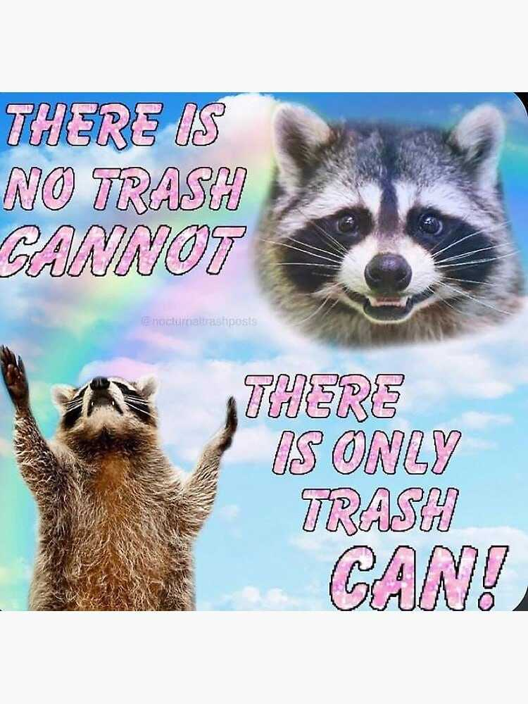
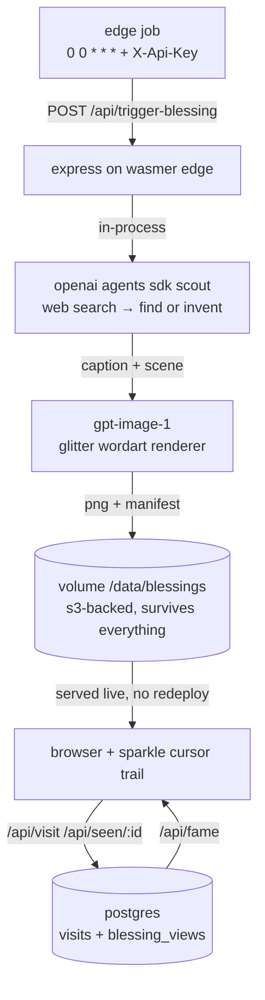

<div align="center">



# ☆ﾟ.*･｡ﾟ motivational-raccoon-and-friends ﾟ｡･*.ﾟ☆

### the blazingly fast, AI-powered, web-scale, edge-native, serverless¹ (de)motivational trash animal delivery platform

*one blessing per day. as nature intended. no rats.*

[](https://trash.delivery)
[](#code-of-conduct)
[](#)
[](#)
[](#)
[](#-contributing)

**[🦝 LIVE AT TRASH.DELIVERY 🦝](https://trash.delivery)** •
**[📜 whitepage](https://trash.delivery/whitepaper.html)** •
**[🤖 agent skill](https://trash.delivery/skill.md)** •
**[⭐ smash that star button](#-star-history)** •
**[💬 join our discord²](#)**

</div>

---

> [!IMPORTANT]
> This project is **production-grade**.³ It runs unsupervised, spends real money on
> AI-generated possum imagery every midnight UTC, and nobody can stop it.

> [!WARNING]
> Side effects may include: unearned confidence, feral gratitude, and the sudden
> urge to yell at the ocean until it gives you fries.

## 📖 table of contents

<details>
<summary>click 2 expand (industry standard since nobody scrolls anymore)</summary>

- [✨ features](#-features)
- [🏗️ architecture](#%EF%B8%8F-architecture)
- [🚀 quickstart](#-quickstart)
- [📊 benchmarks](#-benchmarks)
- [🗺️ roadmap](#%EF%B8%8F-roadmap)
- [🤝 contributing](#-contributing)
- [❓ FAQ](#-faq)
- [⭐ star history](#-star-history)
- [📄 license](#-license)

</details>

## ✨ features

| | motivational-raccoon-and-friends | motivational posters (1994) | LinkedIn |
|---|:---:|:---:|:---:|
| daily inspirational content | ✅ | ❌ | 🤮 |
| trash animals | ✅ | ❌ | some |
| AI agent curates autonomously | ✅ | ❌ | ✅ (unfortunately) |
| zero-redeploy content pipeline | ✅ | n/a | n/a |
| honest about ur chances | ✅ | ❌ | ❌ |
| sparkle cursor trail | ✅ | ❌ | ❌ |
| rats | ❌ | ❌ | ✅ |

- ⚡ **Blazingly fast** — the raccoon appears in O(1) raccoons per page load
- 🧠 **AI-powered** — a gpt-5 scout agent with web search *finds* fresh blessings, and when the internet disappoints, *invents* them and renders with gpt-image-1
- 🌍 **Edge-native** — deployed on [Wasmer Edge](https://wasmer.io) as one npm project, no Dockerfile, no YAML pipeline with 400 lines, just vibes and `wasmer deploy`
- 🗄️ **Web-scale persistence** — two (2) entire Postgres tables
- 📦 **Zero-redeploy CMS** — an S3-backed volume mounted into the served directory; the agent writes, the site updates, nobody deploys
- 👑 **Adoration-ranked hall of fame** — every blessing ever, democratically sorted by clicks
- 🔗 **Deep links** — `#i-am-held-together` is a valid URL fragment and honestly a valid life philosophy
- 🔐 **Enterprise security** — the generation endpoint fails closed behind an API key, because the only thing worse than no possum is unauthorized possum

## 🏗️ architecture

*(every serious README has a mermaid diagram. here is ours.)*



## 🚀 quickstart

*(tested on my machine)*

```bash
git clone https://github.com/you/motivational-raccoon-and-friends
cd motivational-raccoon-and-friends
npm install
npm run dev          # local sparkles on :8642
```

Ship it:

```bash
wasmer deploy --build-remote   # first deploy; then connect the repo to wasmer
wasmer app secret create OPENAI_API_KEY sk-...
wasmer app secret create TRIGGER_TOKEN $(openssl rand -hex 24)
make migrate-db-remote DATABASE_URL=postgres://...   # PGSSLMODE=require, ask us how we know
git push   # this IS the deploy. we do gitops here. the raccoon reviews nothing
```

Press <kbd>Ctrl</kbd>+<kbd>Shift</kbd>+<kbd>🦝</kbd> to feel something.⁴

## 📊 benchmarks

Rigorous, peer-reviewed,⁵ reproducible:

$$
\text{adoration} = \sum_{d=1}^{\infty} \frac{\text{clicks}_d}{\text{self esteem}_d + \varepsilon}, \quad \varepsilon > 0 \text{ (always)}
$$

| metric | value | methodology |
|---|---|---|
| time to first raccoon | ~120ms | felt fast |
| blessings per day | exactly 1 | by design, we call it "rate limiting" |
| horrors persisting | yes | but so do we |
| Lighthouse score | unmeasured | the lighthouse is a social construct |

## 🗺️ roadmap

- [x] raccoon
- [x] and friends
- [x] AI agent that gaslights the concept of motivation itself
- [x] postgres-backed adoration economy
- [ ] blockchain⁶
- [ ] `raccoon-as-a-service` SDK (rust rewrite, obviously)
- [ ] IPO

## 🤝 contributing

We follow the [Contributor Covenant](https://www.contributor-covenant.org/), extended
with one additional protected commandment:

> **NO RATS.**

1. Fork it
2. Create your feature branch (`git checkout -b feat/more-possums`)
3. Commit using [conventional commits](https://www.conventionalcommits.org/) (`feat(possum)!: add lore`)
4. Open a PR and wait for the CODEOWNERS (two raccoons, one seagull) to review

<details>
<summary>🏛️ governance model</summary>

Decisions are made by BDFL (Benevolent Dumpster For Life). Disputes are settled by
whichever animal screams loudest at 3am, same as every other open source project.

</details>

## ❓ FAQ

<details>
<summary><b>is this webscale?</b></summary>

The raccoons are horizontally scalable. The volume is read-write-many. The trauma is shared-nothing.

</details>

<details>
<summary><b>why not kubernetes?</b></summary>

We tried explaining ingress controllers to the possum. It played dead. We respect that and honestly it was the correct review.

</details>

<details>
<summary><b>raccoon or racoon?</b></summary>

We spent real engineering hours on this migration. Two c's. There is a legacy-key
compatibility shim in production because of it. This is the most honest sentence in this README.

</details>

<details>
<summary><b>can I use this in my company?</b></summary>

The blessings are load-bearing. Consult your therapist before removing them.

</details>

## ⭐ star history

```
  ★ 10,000 │                                    ⣀⣤ (projected)
           │                              ⣀⣤⠶⠋
   ★ 1,000 │                        ⣀⣴⠟⠉
           │        (you are here) ⢀⡞
       ★ 2 │ ⠶⠶⠶⠶⠶⠶⠶⠶⠶⠶⠶⠶⠶⠶⠶⠶⠶⠶⠶⠋
           └──────────────────────────────────────────
             day 1        someone posts it on HN⁷
```

## 💖 sponsors

<div align="center">

*your logo here*

*(the raccoons accept payment in unlocked dumpsters)*

</div>

## 📄 license

**© whenever. the raccoons own the rights.**

Software is provided "AS IS", the same condition in which the possum was found.

---

<div align="center">

*made with 🗑️ by humans and one (1) increasingly autonomous agent*

**if you read this far, the horrors persist, but so do you** ✨

</div>

---

¹ there is a server. there is always a server. it is a metaphor.
² there is no discord. this link, like the concept of work-life balance, points to `#`.
³ "production" is wherever your users are. our users are raccoons.
⁴ this keybinding does nothing. neither does most of ours.
⁵ reviewed by peers. the peers are raccoons. see whitepage.
⁶ no. this item exists to farm engagement in the issues tab.
⁷ flagged: "Show HN: I made a possum say things" (312 comments, all about rust)
